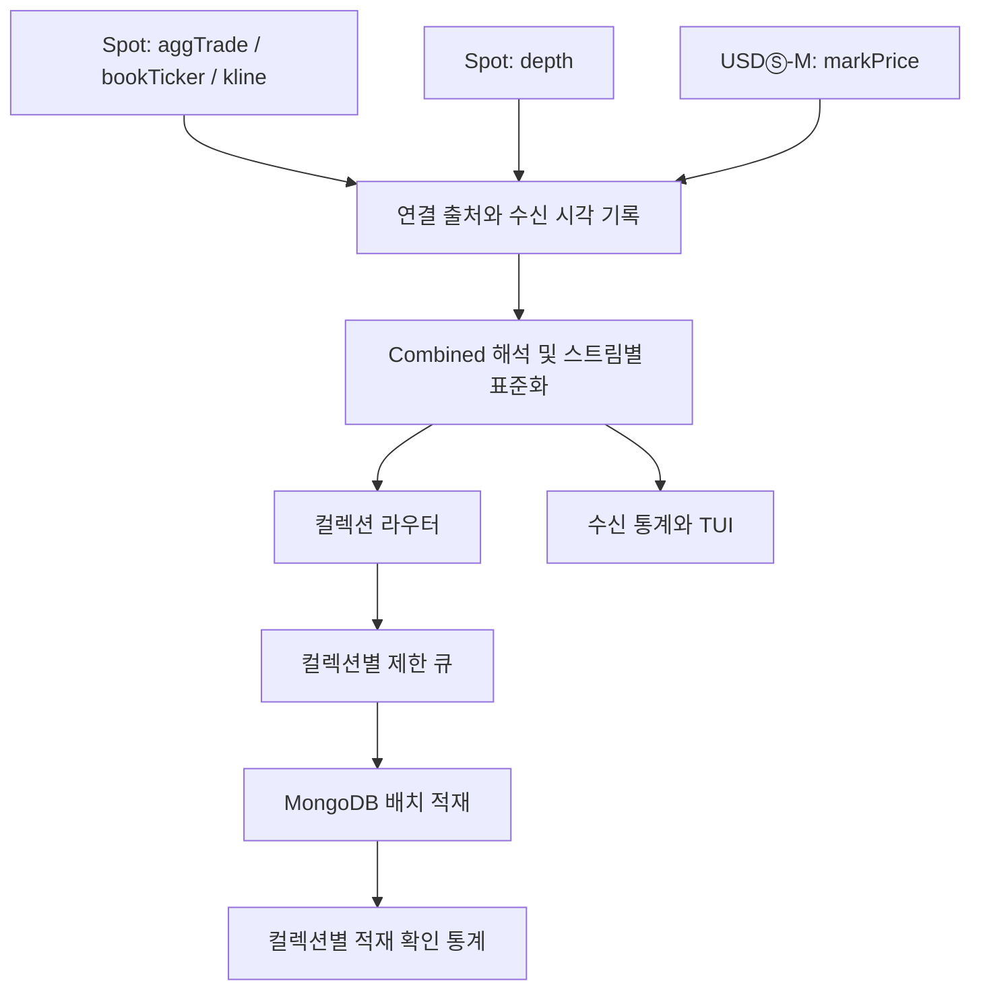

# Binance 수집기 다중 스트림 확장 계획

작성 기준: 2026-09-17. 현재 코드와 Binance 공식 문서를 검토한 계획안이며, 아래 기능과 성능 검증은 아직 구현·실행하지 않았다.

문서 안의 소스·산출물 경로는 `/Users/ahh/Sandbox/finance/collector`를 기준으로 한다.

## 1. 권장 방향과 범위

기존 **Spot 수집을 유지하면서 4종 스트림을 수집하고, 같은 symbol의 USDⓈ-M 선물 markPrice를 추가**한다. Spot 데이터의 연속성을 유지하면서 체결, 호가, 캔들, 선물 기준가격을 확보하는 방향이다. 이번 계획은 기존 구현 계획의 Phase 1–10에 이어 Phase 11–16으로 구성한다.

symbol은 현재 `src/config.py`의 아래 10개와 표시 순서를 유지한다.

```text
BTCUSDT ETHUSDT BNBUSDT SOLUSDT XRPUSDT
DOGEUSDT ADAUSDT AVAXUSDT LINKUSDT LTCUSDT
```

| 항목 | 계획의 기본안 |
|---|---|
| 시장 | Spot 4종 + USDⓈ-M USDT 무기한 선물 markPrice |
| 구독 수 | Spot 40개 + 선물 10개 = 총 50개 |
| 수집 단위 | 거래소가 전달한 애플리케이션 메시지 한 건 |
| 저장 단위 | 수신 이벤트 한 건당 MongoDB 문서 한 건 |
| depth | 차분 호가 스트림, `100ms` |
| kline | UTC 기준 `1m`, 진행 중·마감 갱신 모두 저장 |
| markPrice | `1s` |
| 기존 계약 | 원본 값·자료형·추가 필드·중복 이벤트 보존 |
| 저장 구조 | 요청한 5개 데이터 컬렉션 + 제어·예외 보존용 컬렉션 |

`1m`, `100ms`, `1s`는 사용자가 지정한 값이 아니라 이 계획의 제안 기본값이다. symbol 수를 늘리거나 전체 시장 스트림을 구독한 뒤 필터링하는 방식은 도입하지 않는다. 시작 전에 두 시장의 공개 exchangeInfo로 지정 symbol과 상품 유형·거래 상태를 확인한다. 지원하지 않는 symbol이 있으면 누락·대체하지 않고 어떤 구독이 불가능한지 보고한다.

동일한 symbol이어도 현물과 선물은 서로 다른 상품이다. `mark_prices`는 다른 네 컬렉션의 Spot 가격과 별도 시장 데이터로 취급한다. 향후 목적이 선물 거래·선물 호가 분석으로 정해지면 나머지 네 스트림도 선물로 수집하는 별도 확장이 필요하다.

## 2. 현재 구현에서 바뀌는 지점

| 현재 코드 | 확인한 상태 | 확장 내용 |
|---|---|---|
| `src/config.py` | 기본 10개 symbol, MongoDB 단일 collection 설정 | 스트림·시장·연결 그룹·컬렉션 매핑 설정 |
| `src/collector/subscriptions.py` | `agg_trade_streams()`로 aggTrade만 생성 | 구독 명세로 50개 스트림과 연결별 요청 생성 |
| `src/collector/client.py` | Spot Raw WebSocket 한 개, 재연결·ACK 처리 | 연결별 수신·구독·재연결 상태와 출처 전달 |
| `src/collector/parser.py` | 모든 객체에 하나의 `FIELD_NAMES` 적용 | 스트림 판별 후 전용 필드 매핑 |
| `src/models/event.py`, `src/pipeline.py` | 평평한 이벤트를 한 출력에 순차 전달 | 출처를 갖는 v2 이벤트와 스트림별 라우팅 |
| `src/outputs/mongodb.py` | 단일 컬렉션, 제한 큐, 1초 배치 | 컬렉션별 큐·배치와 전체 버퍼 한도 |
| `src/monitoring/stats.py`, `tui.py` | aggTrade와 symbol 중심 통계 | 10개 symbol × 5개 스트림, 연결·저장 상태 |

현재 MongoDB 출력은 큐 접수와 적재 확인을 분리하고, 불확실한 쓰기를 자동 재시도하지 않는다. 이 동작을 유지한다. 현재 큐 상한은 10,000건이고 처리 중 배치도 별도로 존재하므로, 큐 길이만으로 전체 메모리 사용량이 제한된다고 간주하지 않는다.

## 3. 스트림과 틱 수집의 의미

여기서 틱 수집은 **수신한 스트림 갱신을 샘플링하거나 합치지 않고 전부 기록**한다는 뜻이다. MongoDB의 배치 주기는 저장 요청을 묶는 주기이며 데이터 집계 주기가 아니다.

| Stream | 시장 | 구독 이름 | Collection | 수집 기준 |
|---|---|---|---|---|
| `aggTrade` | Spot | `<symbol>@aggTrade` | `agg_trades` | 집계 체결 이벤트가 도착할 때마다 저장 |
| `depth` | Spot | `<symbol>@depth@100ms` | `order_book_depth` | 전달된 호가 변경 메시지를 모두 저장 |
| `bookTicker` | Spot | `<symbol>@bookTicker` | `book_tickers` | 최우선 매수·매도 가격 또는 수량 갱신 저장 |
| `kline` | Spot | `<symbol>@kline_1m` | `klines` | 1분봉의 모든 중간 갱신과 마감 갱신 저장 |
| `markPrice` | USDⓈ-M | `<symbol>@markPrice@1s` | `mark_prices` | 1초 주기로 전달된 가격·펀딩 관련 값 저장 |

`aggTrade`는 거래소가 이미 집계한 체결 데이터다. 개별 매칭 체결 한 건씩을 요구하는 경우에는 별도의 `trade` 스트림 검토가 필요하며, 이번 요청의 5종에는 추가하지 않는다. Spot `kline_1m`의 문서상 갱신 주기는 2초이고, markPrice는 1초 또는 3초를 지원한다. 따라서 5종 모두가 개별 체결마다 도착하는 구조는 아니다. [Spot 스트림 명세](https://raw.githubusercontent.com/binance/binance-spot-api-docs/master/web-socket-streams.md), [USDⓈ-M Mark Price 명세](https://developers.binance.com/en/docs/catalog/core-trading-derivatives-trading-usd-s-m-futures/api/ws-streams/market#mark-price-stream)

`klines`는 완성된 봉만 있는 테이블이 아니라 **캔들 갱신 이력**이다. 같은 symbol·봉 시작 시각의 문서가 여러 개 있어야 하며, `k.x=false`와 `k.x=true`를 모두 보존한다. 봉 단위 upsert나 마감 이벤트만 선별하는 처리는 수집 이후 소비 계층의 책임이다.

## 4. 연결과 구독 구조

초기 구현은 하나의 프로세스에서 다음 3개 WebSocket을 비동기로 운영한다. depth의 큰 메시지와 재연결을 별도로 관리하기 위한 분리이며, 연결 수 자체가 처리량을 보장하지는 않는다.

| 연결 그룹 | 구독 | 개수 | Combined 접속 주소 |
|---|---|---:|---|
| `spot_market` | aggTrade, bookTicker, kline | 30 | `wss://stream.binance.com:9443/stream` |
| `spot_depth` | depth | 10 | `wss://stream.binance.com:9443/stream` |
| `usdm_mark` | markPrice | 10 | `wss://fstream.binance.com/market/stream` |

각 연결에서 해당 그룹의 목록을 한 SUBSCRIBE 요청으로 전달한다. Combined 메시지의 `stream`으로 구독 명세를 찾고 `data`에 스트림별 표준화를 적용한다. 이 방식은 Spot bookTicker처럼 payload에 `e`가 없는 이벤트도 구분할 수 있게 한다. [Spot Combined 형식](https://raw.githubusercontent.com/binance/binance-spot-api-docs/master/web-socket-streams.md)

USDⓈ-M은 현재 `/public`, `/market`, `/private`로 접속 경로가 분리되어 있다. markPrice는 `/market` 경로를 사용해야 한다. 경로 없는 과거 `fstream.../ws` 주소를 복사하면 markPrice 데이터가 오지 않을 수 있으므로, endpoint를 시장·스트림 명세에 포함한다. [USDⓈ-M 연결 명세](https://developers.binance.com/en/docs/products/derivatives-trading-usds-futures/websocket-market-streams/Connect)



연결 관리의 구현 기준은 다음과 같다.

- 연결별 요청 ID, ACK 대기, 구독 실패, 실제 첫 수신을 구분한다. ACK 이전에 도착한 데이터도 보존한다.
- 한 연결의 일시적 네트워크 장애는 해당 연결만 재구독한다. 다른 그룹은 계속 수집하며 TUI에는 일부 연결 장애로 표시한다.
- 기존 1·2·4·8·16·30초 재연결 정책을 재사용하고, 반복적인 구독 오류를 정상 연결로 표시하지 않는다.
- serverShutdown과 연결 수명 종료에 대응한다. 연결을 교체할 때마다 새로운 connection ID와 수신 순번을 부여하고 중단 구간을 기록한다.
- 수신 순서는 연결 내부에서 보존한다. 서로 다른 연결의 이벤트에 전역 거래소 순서가 있다고 가정하지 않는다.
- 시장별 Ping/Pong·제어 요청 한도를 적용한다. 문서의 incoming message 한도는 거래소로 보내는 제어 트래픽 기준으로 해석하고 수신 시장 이벤트를 제한하지 않는다.
- WebSocket 프레임·메시지 크기와 출력 큐를 유한하게 유지한다. 동일 연결 안에서는 출력 지연이 다른 구독에도 영향을 줄 수 있음을 관측한다.

두 시장 모두 연결 수명이 있으므로 장시간 검증에는 실제 연결 교체를 포함한다. [Spot 연결 제한](https://raw.githubusercontent.com/binance/binance-spot-api-docs/master/web-socket-streams.md), [USDⓈ-M 연결 제한](https://developers.binance.com/en/docs/products/derivatives-trading-usds-futures/websocket-market-streams/Connect)

## 5. 이벤트와 표준화 계약

### 5.1 원본 payload와 수집 메타데이터 분리

확장 모드는 다음 v2 구조를 제안한다. 아래 예시는 설계 설명용이다.

```json
{
  "meta": {
    "schema_version": 2,
    "exchange": "binance",
    "market": "spot",
    "stream_type": "bookTicker",
    "stream_name": "btcusdt@bookTicker",
    "received_at_ms": 1800000000100,
    "connection_id": "run-example-spot-market-1",
    "receive_sequence": 12
  },
  "data": {
    "update_id": 12345,
    "symbol": "BTCUSDT",
    "bid_price": "100.00",
    "bid_quantity": "2.50",
    "ask_price": "100.01",
    "ask_quantity": "1.20"
  }
}
```

- `data`에는 원본 payload의 최상위 필드 이름만 바꿔 넣는다. 숫자·문자열·배열·null·중첩 구조를 유지하고 없는 필드를 만들지 않는다.
- `meta.market`은 `spot` 또는 `usdm_futures`로 구분한다. 시장·상품 구분은 symbol 문자열만으로 추론하지 않는다.
- `stream_type`은 구독 종류이고 `data.event_type`은 거래소의 이벤트 이름이다. 예를 들어 depth의 event type은 `depthUpdate`이므로 두 값을 같게 만들지 않는다.
- Spot bookTicker에 없는 event type·거래소 event time은 `data`에 채워 넣지 않는다. `received_at_ms`는 수신기의 로컬 UTC 시각이며 거래소 시각을 대체하지 않는다.
- connection ID는 실행과 재연결을 구별하고, `receive_sequence`는 해당 연결에서 recv가 반환한 모든 애플리케이션 메시지에 증가시킨다. 식별자는 중복 제거 키로 사용하지 않는다.
- Combined의 `stream`은 `meta.stream_name`에 보존한다. `stream`·`data` 이외의 외피 필드가 추가되면 별도 `transport` 객체에 그대로 보존한다.
- JSON 해석 실패·키 충돌·손실 우려 숫자·바이너리는 기존 원문/Base64 보존 방식을 유지한다. 알 수 없는 형식은 임의로 기존 스트림 스키마에 끼워 맞추지 않는다.

기존 평평한 문서와는 스키마가 달라진다. 이를 명시적인 v2 형식으로 도입하고 기존 `binance_events` 문서에 소급 적용하지 않는다. `EventOutput`의 open/write/close 생명주기는 유지하되 확장 모드 소비자는 v2 구조를 받도록 문서화한다.

### 5.2 스트림별 최상위 필드 매핑

공통 필드는 원본에 있을 때만 `e → event_type`, `E → event_time`, `s → symbol`로 매핑한다. 나머지는 아래 전용 규칙을 적용한다.

| 스트림 | 주요 매핑 | 유지할 내용 |
|---|---|---|
| aggTrade | `a → trade_id`, `p → price`, `q → quantity`, `T → trade_time`, `f → first_trade_id`, `l → last_trade_id`, `m → is_buyer_maker` | 기존 명명 유지. trade_id는 집계 체결 ID이며 미매핑 필드도 보존 |
| depth | `U → first_update_id`, `u → final_update_id`, `b → bids`, `a → asks` | 가격·수량 배열, 문자열과 0 수량을 그대로 보존 |
| bookTicker | `u → update_id`, `b → bid_price`, `B → bid_quantity`, `a → ask_price`, `A → ask_quantity` | 원본에 없는 `e`·`E`를 생성하지 않음 |
| kline | 공통 필드만 매핑, `k`는 그대로 유지 | `k.t`, `k.T`, `k.i`, OHLCV, `k.x`와 추가 중첩 필드 전체 |
| markPrice | `p → mark_price`, `i → index_price`, `P → estimated_settle_price`, `r → funding_rate`, `T → next_funding_time` | `ap`, `st` 등 미매핑·추가 필드도 원래 이름으로 보존 |

특히 `a`는 체결 ID·매도 호가 배열·최우선 매도가로 의미가 다르고, markPrice의 `T`는 다음 펀딩 시각이다. 현재 공통 매핑을 그대로 확대하면 잘못된 이름의 데이터가 저장되므로 이 구분을 단위 테스트로 고정한다. [Spot payload 명세](https://developers.binance.com/docs/binance-spot-api-docs/web-socket-streams), [Mark Price payload 명세](https://developers.binance.com/en/docs/catalog/core-trading-derivatives-trading-usd-s-m-futures/api/ws-streams/market#mark-price-stream)

## 6. MongoDB 컬렉션과 배치

요청한 5개 컬렉션에는 해당 시장 데이터만 저장한다. 구독 ACK·오류, 서버 안내, 미분류 메시지, 원문 보존 메시지는 `collector_control`에 저장한다. 이는 현재 보존하던 비거래 메시지의 저장 위치를 분리하기 위한 보조 컬렉션이다. 로컬에서 생성한 재연결·장애 로그와 수신 메시지 건수는 별도로 계수한다.

`MongoMultiCollectionOutput`을 출력 구성 지점에 연결하고, MongoDB 클라이언트 하나를 공유한다. 각 컬렉션은 순서가 있는 큐와 순차 writer 하나를 가지며 전체 동시 쓰기 수를 제한한다. 한 컬렉션의 배치 결과를 다른 컬렉션의 성공으로 계수하지 않는다.

| 설정 | 제안 초기값·정책 |
|---|---|
| flush 간격 | 유휴 writer는 첫 이벤트 후 1초 안에 flush 시도. 처리 중 쓰기로 인한 추가 대기는 별도 측정 |
| 조기 flush | 1,000건 또는 직렬화 크기 4 MiB 도달 시 적재 시작 |
| 전체 버퍼 | 큐 + 처리 중 배치 합계 10,000건, 직렬화 크기 합계 64 MiB 상한 |
| 컬렉션별 버퍼 | 전체 예산 안에서 개별 상한을 두고 부하 측정 후 배분 |
| 순서 | 연결·컬렉션 내부 수신 순서 유지, 기본 `ordered=True` |
| 포화 | 새 문서를 버리지 않고 접수를 기다리는 backpressure 적용 |
| 자동 재시도 | 쓰기 결과가 불확실한 배치는 자동 재전송하지 않음 |
| 삭제·중복 제거 | TTL, unique 업무 키, upsert, 자동 삭제를 기본으로 사용하지 않음 |

위 크기는 검증 전 시작값이며 처리량 보장 수치가 아니다. 큐에서 배치로 옮겨도 예산은 즉시 반환하지 않고 처리 중 문서까지 포함한다. 직렬화 크기는 Python 객체와 드라이버의 실제 메모리 사용량과 다르므로 RSS도 별도로 측정한다. 전체 상한을 넘는 단일 메시지를 무한 대기시키지 않고 명시적인 오류로 보고한다.

기본 조회 인덱스는 각 데이터 컬렉션의 `(meta.market, data.symbol, meta.received_at_ms)` 비고유 복합 인덱스를 제안한다. `klines`의 `(meta.market, data.symbol, data.k.i, data.k.t)`는 조회 필요가 확인되면 추가한다. 캔들 중간 갱신과 재수신을 보존해야 하므로 symbol·이벤트 ID·봉 시작 시각에 unique 제약을 걸지 않는다.

오류와 종료는 다음 기준으로 처리한다.

1. 수신, 큐 접수, MongoDB 적재 확인, 처리 중, 쓰기 결과 미확인 건수를 구분한다.
2. 일부 문서 저장 후 실패한 배치는 확인 가능한 성공분만 반영한다. 응답을 잃은 문서는 전체 성공이나 전체 실패로 단정하지 않는다.
3. 하나의 writer가 실패하면 모든 연결의 새 수신을 중단한다. 정상 writer는 접수된 잔여분을 정리하고, 실패 writer의 잔여·미확인 건수와 원인을 기록한 뒤 오류 종료한다.
4. 정상 종료는 새 수신 중단 → 이미 수신한 메시지의 전달 정리 → 모든 큐 flush → 클라이언트 종료 순서다. 정리 제한 시간 초과는 성공 종료로 표시하지 않는다.

메모리 큐와 WebSocket만으로 중단·강제 종료 구간의 무손실 또는 정확히 한 번 저장을 보장하지 않는다. 영속 큐, 재처리, 과거 데이터 복구는 이후 요구에 따라 별도 설계한다.

## 7. depth의 수집 범위와 연속성

`order_book_depth`에는 호가 변경 메시지를 저장한다. 완성된 현재 호가창을 재구성하려면 별도의 REST snapshot과 update ID 연결 절차가 필요하다. 이번 단계는 변경 이력 수집까지이며, snapshot 수집·호가창 상태 재구성은 후속 작업으로 둔다. 수량은 해당 가격대의 갱신된 수량이므로 수집기가 임의로 증감량으로 변환하지 않는다. [Spot depth 및 호가창 구성 절차](https://raw.githubusercontent.com/binance/binance-spot-api-docs/master/web-socket-streams.md#how-to-manage-a-local-order-book-correctly)

관측 기능은 symbol별로 관측한 최대 `u`를 유한한 상태로 유지한다. 같은 연결에서 다음 `U > 이전 최대 u + 1`이면 누락 의심을 표시하고, 겹치는 범위·반복 이벤트도 삭제하지 않는다. 이전 범위의 재수신으로 기준 ID를 낮추지 않는다. 재연결 직후에는 기준을 새로 잡고 연결 사이 공백을 따로 기록한다. 이 검사는 수신한 ID 범위의 연속성 확인이며 완전한 호가창 복구를 의미하지 않는다.

## 8. 모니터링과 검증 기준

TUI는 symbol 10행, 스트림 5열의 최근 1초 수신량을 기본으로 표시한다. 별도 상태 영역에 세 연결의 ACK·최근 수신·재연결, 컬렉션별 큐 길이·바이트·적재 확인·미확인, 최근 batch 지연을 보여준다. 거래 이벤트와 제어·예외 이벤트 합계를 구분하고 통계 이력을 무제한 보관하지 않는다.

마지막 수신 이후 시간은 스트림 특성별로 해석한다. 시장 변화가 있어야 발생하는 스트림의 0건 구간을 즉시 연결 장애로 단정하지 않는다. 거래소 시각이 있는 이벤트에서만 해당 시각과 수신 시각 차이를 보조 지표로 계산하며, 로컬 시계 오차의 영향을 구분한다.

| 검증 구분 | 완료 기준 |
|---|---|
| 설정·구독 | 기존 10개 symbol로 정확히 50개 구독 생성, 시장별 지원 여부와 30/10/10 그룹 확인 |
| 표준화 | 5종의 매핑, 문자열·정수·bool·null·배열·추가 필드 보존, 미지원 형식 원문 보존 |
| 특수 의미 | bookTicker의 e/E 부재, markPrice의 T, depth의 a, kline의 중첩 T와 x를 각각 검증 |
| 라우팅 | 각 데이터 컬렉션에 다른 종류가 섞이지 않고 제어·예외는 collector_control에 보존 |
| 수량 | 정상 종료한 모의 입력 N건이 전체 컬렉션 합계 N건이며, 중복·ACK·예외도 포함 |
| 순서 | connection ID·수신 순번으로 연결 및 컬렉션 내부 순서를 확인 |
| 캔들 | 같은 봉의 여러 갱신과 마감 이벤트가 모두 append됨 |
| 버퍼·부하 | 느린 DB·포화·큰 depth 메시지에서 큐와 처리 중 배치의 합계가 한도 이내 |
| 장애 | ACK 누락·구독 거절·단일 연결 끊김·DB 부분 성공·타임아웃·Ctrl+C·정리 시간 초과 검증 |
| 회귀 | 기존 aggTrade 실행·stdout·TUI·인증 DB 설정·원문 보존 계약 유지 |

라이브 검증은 다음 순서로 진행한다. 아래 시간은 향후 검증 계획이며 이번 계획 작성 중 실행한 결과가 아니다.

1. **30분 통합 수집:** 10개 symbol × 5종을 연결하고, 실제 6개 임시 컬렉션의 건수·타입·원문 보존·마감 캔들·연결 종료 후 잔여 큐를 확인한다. 구독 ACK만으로 전체 수신 성공을 선언하지 않는다.
2. **부하와 장애 검증:** 관측한 유입량을 기준으로 모의 피크·느린 쓰기·연결 끊김을 재현한다. 정상 종료 시 수신 수와 실제 저장 수가 일치하고, 실패 시 미확인 구간이 설명되어야 한다.
3. **최소 26시간 안정성 검증:** 실제 연결 수명 경계를 지나며 재구독, 메모리 추이, 큐 적체, 모든 스트림의 재개를 확인한다. 정상 부하에서 큐가 계속 증가하거나 Python 메모리가 지속 증가하면 통과시키지 않는다.

저장 용량은 측정한 `초당 문서 수 × 평균 BSON 크기 × 86,400`을 기본으로 추정하고, 실제 MongoDB 데이터·인덱스·압축 크기를 함께 기록한다. 측정 없이 일일 저장량이나 처리 가능 TPS를 확정하지 않는다.

## 9. Phase–Step 구현 순서

모든 Phase는 아직 미착수다. 각 Phase 또는 핵심 Step의 관련 검증을 통과한 후 해당 변경만 독립 커밋하는 경계로 계획한다.

| Phase | Step | 구현 내용 | 주요 산출물 | 완료 기준 |
|---|---|---|---|---|
| 11. 설정·계약 | 1 | 시장·stream·collection·연결 그룹과 v2 계약 정의 | `src/config.py`, `src/models/event.py`, 신규 `src/collector/streams.py` | 기본 10개와 50개 구독 명세, 지원 조합 검증 |
| 11. 설정·계약 | 2 | 기존/확장 실행 profile, 실행 전 상품 확인 설계·구현 | 설정·구독 테스트, `.env.example` | 지원하지 않는 조합·symbol을 조용히 제외하지 않음 |
| 12. 표준화 | 1 | Combined 해석과 출처·수신 정보 전달 | `parser.py`, `pipeline.py`, 메시지 fixture | e가 없는 메시지, ACK, 외피 추가 필드 보존 |
| 12. 표준화 | 2 | 스트림별 매핑과 제어·예외 분류 | 신규 스트림별 parser 모듈, 표준화 테스트 | a/T 충돌 방지, k 중첩·값·자료형 보존 |
| 13. 수집 연결 | 1 | 세 연결 동시 실행과 연결별 상태 | `client.py`, `subscriptions.py`, `main.py` | 30/10/10 구독, ACK·실수신 분리 |
| 13. 수집 연결 | 2 | 재구독, 수명 종료, 공통 종료 관리 | `reconnect.py`, 연결·종료 테스트 | 단일 네트워크 장애 복구, 누적 통계와 출처 유지 |
| 14. MongoDB | 1 | 컬렉션 라우터·제한 큐·배치 writer | 신규 `src/outputs/mongodb_multi.py`, `factory.py`, `run_mongodb.py` | 5+1 컬렉션 분리, 전체 건수·바이트 예산 |
| 14. MongoDB | 2 | 부분 성공, 미확인 쓰기, 종료 flush·인덱스 | MongoDB 단위·통합 테스트 | 적재 확인 정확성, 포화·장애·종료 검증 |
| 15. 관측 | 1 | symbol × stream 통계와 컬렉션별 저장 상태 | `stats.py`, `tui.py`, 관련 테스트 | 수신·접수·적재·미확인 수치 일관성 |
| 15. 관측 | 2 | depth 연속성·연결 공백·지연 관측 | 유한 상태의 연속성 관측 모듈, 테스트 | 이벤트 변경 없이 누락 의심·공백 표시 |
| 16. 통합 검증 | 1 | 회귀·30분 라이브·부하/장애 검증 | 기존 및 신규 테스트, 검증 기록 | 실제 sink 기준 50개 조합과 보존 계약 확인 |
| 16. 통합 검증 | 2 | 26시간 검증·용량 산정·운영 안내 | `README.md`, 신규 `docs/MULTI_STREAM_VALIDATION.md` | 재연결·메모리·큐 안정성 근거와 미검증 사항 기록 |

구현 순서는 **계약 → 파서 → 연결 → 저장 → 관측 → 라이브 검증**이다. 각 단계에서 모의 입력으로 검증하고, 실제 수집에서는 stream 종류를 순차 활성화하며 문제를 좁힌다. 최종 검증의 symbol 범위는 항상 기존 10개다.

## 10. 적용과 완료 판단

기존 실행과 기존 `binance_events` 데이터는 유지하고, 명시적으로 확장 profile을 선택했을 때 새로운 수집·저장 구조를 사용한다. 기존 문서를 자동 이동·변환하지 않는다. `DATALAKE_COLLECTION_NAME`은 기존 profile의 단일 컬렉션 설정으로 유지하고, 확장 profile은 위 매핑을 사용한다. 시작 로그에 실제 시장·구독·DB·컬렉션 설정을 표시해 적용 범위를 확인할 수 있게 한다.

다음 명령은 **구현 완료 후 사용할 인터페이스 제안**이다. 현재 코드에서는 `--profile`, `--kline-interval`, `--depth-speed`, `--mark-price-speed`를 지원하지 않는다.

```bash
conda activate sandbox
python -m src.run_mongodb --profile multi-stream --kline-interval 1m --depth-speed 100ms --mark-price-speed 1s
```

Python 실행·검증은 사용자 지시에 따라 Conda `sandbox` 환경에서 수행한다. 고정 의존성은 기존 `requirements.txt`를 기준으로 확인한다. 다음 검증 명령은 구현 단계에서 실행한다.

```bash
conda activate sandbox
python -m pip check
python -m unittest discover -s tests -v
```

확장 모드 적용 전에는 v2 문서 구조를 소비자가 읽을 수 있는지 확인한다. 롤백은 확장 실행을 중단하고 기존 profile로 재시작하는 방식이며 신규 컬렉션을 삭제하지 않는다. 26시간 검증까지 끝나면 Phase 16을 완료로 표시한다. 이번 문서 작성의 결과는 확장 계획이며, 수집 코드 구현이나 라이브 검증 완료를 뜻하지 않는다.
